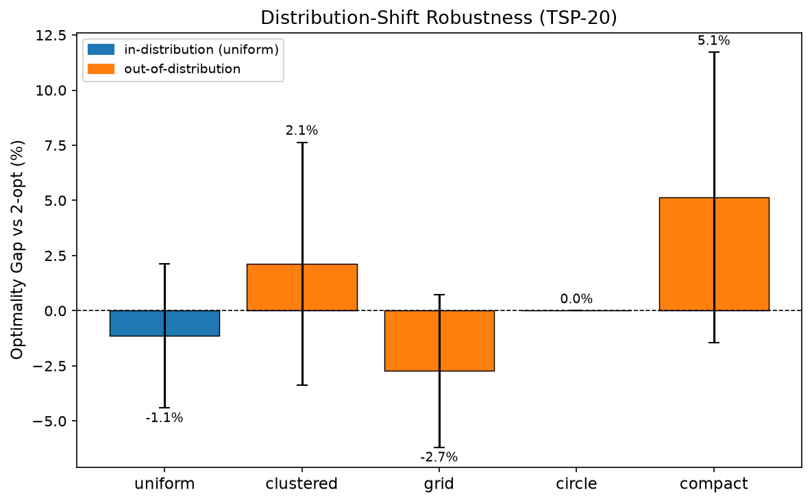
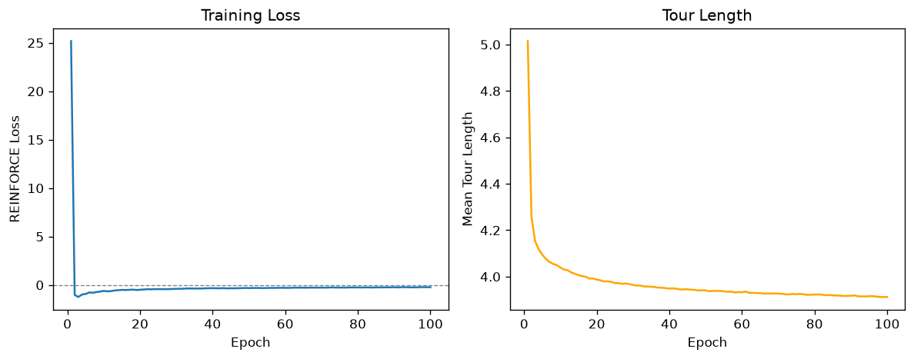

# rl-tsp

**Strongest finding:** A TSP-20 attention model trained only on uniform random cities matches or _beats_ the 2-opt heuristic on four of five test distributions — including out-of-distribution ones — with the single notable exception being cities confined to a compact sub-region (+5.1% gap).

**Demonstrates:** Attention-based REINFORCE with a greedy rollout baseline; distribution-shift robustness analysis; surprising OOD generalization of learned routing policies.

---

## What this is

An attention-based policy network (encoder-decoder transformer) trained with REINFORCE to construct TSP tours, followed by a distribution-shift robustness analysis evaluating the same frozen policy on five city-layout distributions it was never trained on.

Architecture follows Kool et al. 2019 ("Attention, Learn to Solve Routing Problems"), implemented independently and scaled to fit a 6 GB laptop GPU.

---

## Results

### Distribution-shift analysis (main result)

Model trained on **uniform** random cities, evaluated without retraining on all five distributions. Optimality gap vs 2-opt (nearest-neighbor initialized, iterated until convergence):

| Distribution | Gap vs 2-opt | Model tour | Model wins? |
|---|---|---|---|
| uniform (in-dist) | −1.1% ± 3.3% | 3.891 | ✓ |
| grid              | −2.7% ± 3.5% | 4.704 | ✓ |
| circle            | −0.0% ± 0.0% | 2.565 | ✓ |
| clustered         | +2.1% ± 5.5% | 2.158 | — |
| compact           | +5.1% ± 6.6% | 1.646 | — |

Gap = (model − 2-opt) / 2-opt × 100%. Negative = model shorter. Evaluation: 1000 instances per distribution, fixed seed 1234.

**What this means:** The policy generalizes strongly to grid and circle layouts despite never seeing them, likely because these have strong spatial regularities that the attention mechanism exploits. The circle result is exact (both the model and 2-opt find the ring tour). Degradation on compact (cities in one corner) is the largest; plausibly because the spatial scale mismatch compresses the useful range of the learned attention scores, but this is a hypothesis — the attention internals were not inspected.

**Scope:** Experiments are at TSP-20; scaling to TSP-50+ would require larger `d_model` and longer training, and OOD transfer behavior may differ at scale.



### Training convergence

100 epochs, 500 steps/epoch, batch 256, TSP-20, ~38 min on RTX 3050 6 GB.

| Epoch | Avg tour length |
|---|---|
| 1   | 5.015 |
| 10  | 4.039 |
| 50  | 3.941 |
| 100 | 3.912 |



---

## Architecture

**Encoder:** Linear 2D→128 embedding + 3 transformer encoder layers (8 heads, FF dim 512, no positional encoding — TSP is permutation-invariant over cities).

**Decoder:** Autoregressive. At each step, a context vector (`[graph_emb, first_city_emb, last_city_emb]` projected to 128-d) attends over unvisited city embeddings. Visited cities are masked with −∞. Logits are tanh-clipped at C=10. Stochastic during training (multinomial), greedy argmax at evaluation.

**Baseline:** Frozen copy of the policy rolled out greedily. Updated to the current policy only when a paired t-test (p < 0.05, one-sided) confirms the current policy is significantly shorter on a held-out validation set of 1000 instances. This gate is the key stability mechanism — updating every epoch causes high variance.

---

## Reproducing

```bash
# full TSP-20 training (~38 min, RTX 3050 6 GB)
bash scripts/train_tsp20.sh

# distribution-shift analysis (after training)
bash scripts/run_shift_analysis.sh checkpoints/model_ep0100.pt

# run all tests
python -m pytest tests/ -v
```

Smaller / OOM fallback:
```bash
python src/train.py --small           # TSP-10, batch 128, 5 epochs
python src/train.py --n_cities 10 --batch_size 128
```

---

## Project structure

```
rl-tsp/
  config.py               hyperparameters (dataclass)
  src/
    env.py                city generation (5 distributions), tour length
    model.py              attention encoder-decoder
    baseline.py           greedy rollout baseline + t-test update gate
    train.py              REINFORCE training loop
    evaluate.py           optimality gap computation
    heuristics.py         nearest-neighbor, 2-opt, OR-Tools wrapper
    distribution_shift.py OOD evaluation + plots
    plotting.py           tour viz, training curves, shift bar chart
  scripts/
    train_tsp20.sh
    run_shift_analysis.sh
  tests/
    test_env.py           tour-length correctness, distribution shapes (14 tests)
    test_model.py         output shapes, masking, no NaNs (8 tests)
```

---

## Dependencies

```
torch>=2.2  numpy  scipy  matplotlib  tqdm
```

OR-Tools is not required. If unavailable (default), the solver baseline falls back to nearest-neighbor + 2-opt, labeled "2-opt" throughout. On TSP-20, 2-opt is typically 1–3% above exact optimal (Concorde); all comparisons in this README are against 2-opt, not optimal.

---

## Reference

Kool, W., van Hoof, H., & Welling, M. (2019). Attention, Learn to Solve Routing Problems! *ICLR 2019*. arXiv:1803.08475.
